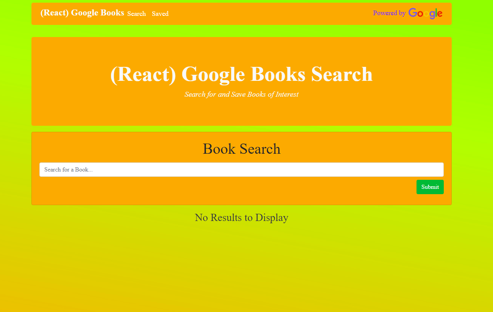
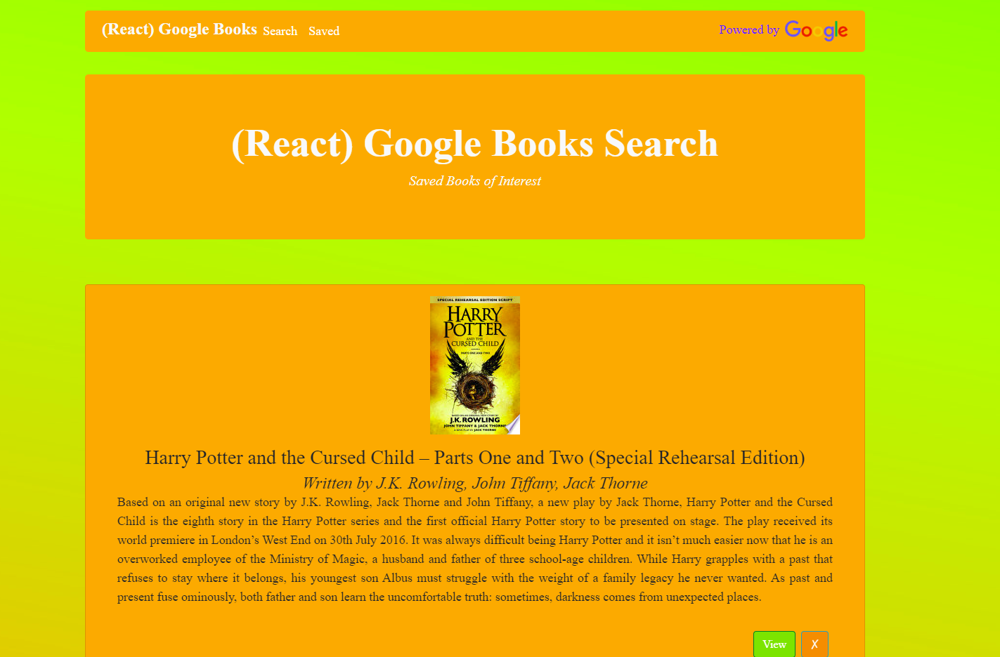

# Google React Books

 

### A Full Stack Mern App

### Deployed to [Heroku](https://grb2019.herokuapp.com/)

This is a full-stack MERN app that sources Google Books API. The user can search for anything in the google books store. Those results are then rendered to the page where the user can then save favorites to MongoDB. By using Socket.io, every time a book is saved, all open browsers using the app are alerted.

#Technology Used

- React
- MongoDB
- Node
- Express
- if-Env
- Mongoose
- dotenv
- body-parser
- ESlint
- nodemon
- concurrently
- Create-react-app
- Heroku
- Mlab
- Socket.io

