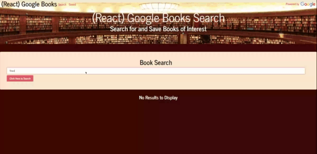

# Google React Books
### A Mern React App

### Deployed to [Heroku](https://googlereactbooks1.herokuapp.com/)

This is a Full-Stack MERN Book searching app that sources the Google Books API. After rending on the page, the user can then save to book to a list thats stored in MongoDB.

#Technology Used
- Mern
- React
- Node
- Express
- if-Env
- Mongoose
- dotenv
- body-parser
- eslint
- nodemon
- cocurrently
- Create-react-app
- Heroku
- Mlab
- React Hooks
- Socket.io